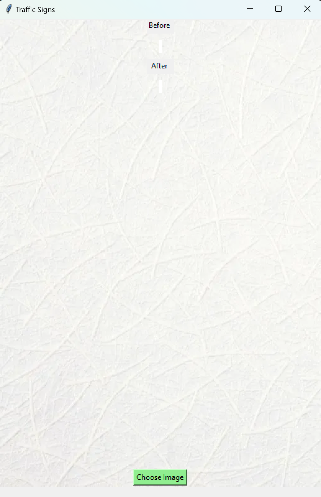
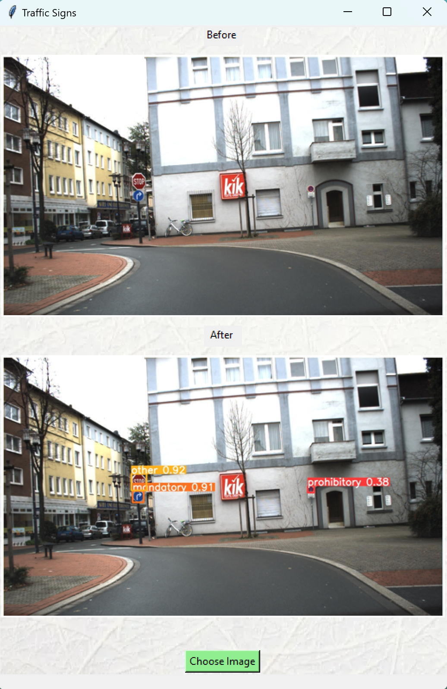

# YOLO_ML

В папке app необходимо разархивировать archive.zip \
Запустить необходимо app.py \
После запуска появится окно, в которое можно загрузить изображение \
\
Далее появится изображение до и после обработки \

